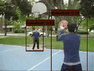
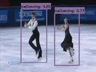
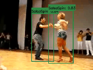

# YOWO-Bamboo: An enhanced model for giant panda action recognition 
We proposed an efficient real-time detection model YOWO-Bamboo for giant panda action recognition, which has demonstrated remarkable improvements over the YOWO-Plus by optimizing backbone and loss functions. The mean Average Precision (mAP) was increased from 61.5% to 66.5%, achieving higher recognition accuracy.

# Improvement
- 2D backbone: The ConvNeXt network is utilized owing to its simplicity and efficiency, leveraging the large model scale from the series along with ImageNet-22K pre-trained weights at 224x224 resolution.

- Loss functions: For the confidence and bounding box regression loss functions, we opt for Huber Loss and Distance Intersection over Union (DIoU) loss to optimize object localization and prediction.


# Requirements
- We recommend you to use Anaconda to create a conda environment:
```Shell
conda create -n yowo python=3.6
```

- Then, activate the environment:
```Shell
conda activate yowo
```

- Requirements:
```Shell
pip install -r requirements.txt 
```

# Visualization







# Dataset
Our giant panda dataset, conforming to the AVA format, is a comprehensive compilation encompassing two integral parts: a training set and a validation set. The training set contains 1.5K videos, 1.35M frames, and 48K boxes, while the validation set has 176 videos, 158K frames, and 1.4K boxes. Panda’s behaviors are systematically classified into 22 diverse action types, encompassing continuous postures such as "continuous standing", daily activities like "walking", estrus-specific behaviors like "licking the vulva", and overarching activities designated as "locomotion". 

# Experiment

* AVA v2.2

|     Model      |    mAP    |   FPS   |    weight    |
|----------------|-----------|---------|--------------|
|    YOWO-Plus   |   61.5    |    34   |       -      |
|    YOWOv2-N    |   31.7    |    -    |       -      |
|    YOWOv2-T    |   24.8    |    -    |       -      |
|    YOWOv2-M    |   35.1    |    -    |       -      |
|    YOWOv2-L    |   53.1    |    -    |       -      |
| YOWO-B(YOLOv2) |   65.4    |    34   |  [github](https://github.com/yjh0410/PyTorch_YOWO/releases/download/yowo-weight/yowo_nano_ava_v2.2_K32_19.5.pth)  |
|YOWO-B(ConvNeXt)|   66.5    |    30   |  [github](https://github.com/yjh0410/PyTorch_YOWO/releases/download/yowo-weight/yowo_nano_ava_v2.2_K32_19.5.pth)  |

## Train YOWO-Bamboo
* UCF101-24

```Shell
python train.py --cuda -d ucf24 -v yowo --num_workers 4 --eval_epoch 1 --eval
```

or you can just run the script:

```Shell
sh train_ucf.sh
```

* AVA
```Shell
python train.py --cuda -d ava_v2.2 -v yowo --num_workers 4 --eval_epoch 1 --eval
```

or you can just run the script:

```Shell
sh train_ava.sh
```

##  Test YOWO
* UCF101-24
For example:

```Shell
python test.py --cuda -d ucf24 -v yowo --weight path/to/weight --show
```

* AVA
For example:

```Shell
python test.py --cuda -d ava_v2.2 -v yowo --weight path/to/weight --show
```

##  Test YOWO on AVA video
For example:

```Shell
python test_video_ava.py --cuda -d ava_v2.2 -v yowo --weight path/to/weight --video path/to/video --show
```

Note that you can set ```path/to/video``` to other videos in your local device, not AVA videos.

## Evaluate YOWO
* UCF101-24
For example:

```Shell
# Frame mAP
python eval.py \
        --cuda \
        -d ucf24 \
        -v yowo \
        -bs 8 \
        -size 224 \
        --weight path/to/weight \
        --cal_frame_mAP \
```

# Video mAP
python eval.py \
        --cuda \
        -d ucf24 \
        -v yowo \
        -bs 8 \
        -size 224 \
        --weight path/to/weight \
        --cal_video_mAP \
```


* AVA

Run the following command to calculate frame mAP@0.5 IoU:

```Shell
python eval.py \
        --cuda \
        -d ava_v2.2 \
        -v yowo \
        --weight path/to/weight
```

Our YOWO-Bamboo's result of frame mAP@0.5 IoU on AVAv2.2(our giant panda dataset):
```Shell
AP@0.5IOU/answer phone: 0.6200712155913068,
AP@0.5IOU/bend/bow (at the waist): 0.3684199174015223,
AP@0.5IOU/carry/hold (an object): 0.4368366146575504,
AP@0.5IOU/climb (e.g., a mountain): 0.006524045204733175,
AP@0.5IOU/close (e.g., a door, a box): 0.10121428961033546,
AP@0.5IOU/crouch/kneel: 0.14271053289648555,
AP@0.5IOU/cut: 0.011371656268128742,
AP@0.5IOU/dance: 0.3472742170664651,
AP@0.5IOU/dress/put on clothing: 0.05568205010936085,
AP@0.5IOU/drink: 0.18867980887744548,
AP@0.5IOU/drive (e.g., a car, a truck): 0.5727336663149236,
AP@0.5IOU/eat: 0.2438949290288357,
AP@0.5IOU/enter: 0.03631300073681878,
AP@0.5IOU/fall down: 0.16097137034226533,
AP@0.5IOU/fight/hit (a person): 0.35295156111441717,
AP@0.5IOU/get up: 0.1661305661768072,
AP@0.5IOU/give/serve (an object) to (a person): 0.08171070895093906,
AP@0.5IOU/grab (a person): 0.04786212215222141,
AP@0.5IOU/hand clap: 0.16502425129399353,
AP@0.5IOU/hand shake: 0.05668297330776857,
AP@0.5IOU/hand wave: 0.0019633474257698715,
AP@0.5IOU/hit (an object): 0.004926567809641652,
AP@0.5IOU/hug (a person): 0.14948677865170307,
AP@0.5IOU/jump/leap: 0.11724856806405773,
AP@0.5IOU/kiss (a person): 0.18323100733498285,
AP@0.5IOU/lie/sleep: 0.5566160853381206,
AP@0.5IOU/lift (a person): 0.05071348972423068,
AP@0.5IOU/lift/pick up: 0.02400509697339648,
AP@0.5IOU/listen (e.g., to music): 0.008846030334678949,
AP@0.5IOU/listen to (a person): 0.6111863505487993,
AP@0.5IOU/martial art: 0.35494188472527066,
AP@0.5IOU/open (e.g., a window, a car door): 0.13838582757710105,
AP@0.5IOU/play musical instrument: 0.17637146118119046,
AP@0.5IOU/point to (an object): 0.0030957935199989314,
AP@0.5IOU/pull (an object): 0.006138508972102678,
AP@0.5IOU/push (an object): 0.008798412014783267,
AP@0.5IOU/push (another person): 0.06436728640658615,
AP@0.5IOU/put down: 0.011691087258412239,
AP@0.5IOU/read: 0.23947763826955498,
AP@0.5IOU/ride (e.g., a bike, a car, a horse): 0.3573836844473405,
AP@0.5IOU/run/jog: 0.3893352170239517,
AP@0.5IOU/sail boat: 0.09309936689447072,
AP@0.5IOU/shoot: 0.006834072970687,
AP@0.5IOU/sing to (e.g., self, a person, a group): 0.08181910176202781,
AP@0.5IOU/sit: 0.7709624420964878,
AP@0.5IOU/smoke: 0.05268953989999123,
AP@0.5IOU/stand: 0.7668298075740738,
AP@0.5IOU/swim: 0.17407407407407408,
AP@0.5IOU/take (an object) from (a person): 0.0383472793429592,
AP@0.5IOU/take a photo: 0.025915711741497306,
AP@0.5IOU/talk to (e.g., self, a person, a group): 0.7390988530695071,
AP@0.5IOU/text on/look at a cellphone: 0.009139739938803557,
AP@0.5IOU/throw: 0.015058496300738047,
AP@0.5IOU/touch (an object): 0.3090900998192289,
AP@0.5IOU/turn (e.g., a screwdriver): 0.01904009620734998,
AP@0.5IOU/walk: 0.6288594756415645,
AP@0.5IOU/watch (a person): 0.6489390785120175,
AP@0.5IOU/watch (e.g., TV): 0.11913599687628156,
AP@0.5IOU/work on a computer: 0.18941724461502552,
AP@0.5IOU/write: 0.022696113047944347,
mAP@0.5IOU: 0.20553860351814546
```

## Demo
```Shell
# run test_video_ava
python test_video_ava.py --cuda -d ava_v2.2 -v yowo -size 224 --weight path/to/weight --video path/to/video
```

```
